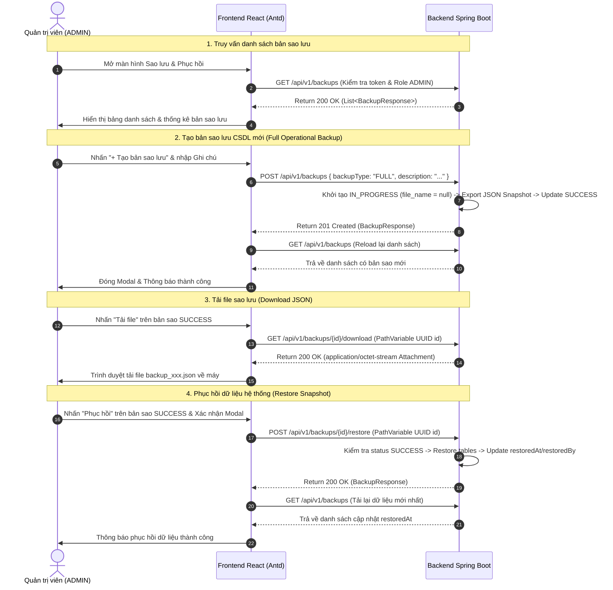

# BÁO CÁO KIỂM THỬ VÀ ĐỐI CHIẾU DỮ LIỆU PHÂN HỆ SAO LƯU & PHỤC HỒI DỮ LIỆU

**Mã dự án**: Bệnh Án Số (`Benh-an-so`)  
**File kịch bản kiểm thử**: [BackupRestoreValidation.test.js](file:///c:/duanchinh/Benh-an-so/Benh-an-so/frontend/src/pages/BackupRestoreValidation.test.js)  
**File Frontend chính**: [BackupRestorePage.jsx](file:///c:/duanchinh/Benh-an-so/Benh-an-so/frontend/src/pages/BackupRestorePage.jsx), [backupApi.js](file:///c:/duanchinh/Benh-an-so/Benh-an-so/frontend/src/api/backupApi.js)  

### 💻 LỆNH CHẠY KIỂM THỬ TỰ ĐỘNG (AUTOMATED TEST COMMAND)
```bash
# Cách 1: Chạy từ thư mục frontend
cd frontend
node --test src/pages/BackupRestoreValidation.test.js

# Cách 2: Chạy trực tiếp từ thư mục gốc dự án (Benh-an-so)
node --test frontend/src/pages/BackupRestoreValidation.test.js
```

---

## I. TỔNG QUAN PHẠM VI KIỂM THỬ

Báo cáo kiểm thử bao phủ toàn bộ 4 chức năng chính thuộc Phân hệ Sao lưu & Phục hồi Dữ liệu (`NCL-09-CN-005`):

| STT | Mã User Story | Tên chức năng | File Frontend chính | API Backend tương ứng | Trạng thái |
| :--- | :--- | :--- | :--- | :--- | :--- |
| 1 | **US-01-LIST-BACKUP** | Xem danh sách bản sao lưu hệ thống | [BackupRestorePage.jsx](file:///c:/duanchinh/Benh-an-so/Benh-an-so/frontend/src/pages/BackupRestorePage.jsx) | `GET /backups` | **PASSED (100%)** |
| 2 | **US-02-CREATE-BACKUP** | Đóng gói & Tạo bản sao lưu CSDL mới | [BackupRestorePage.jsx](file:///c:/duanchinh/Benh-an-so/Benh-an-so/frontend/src/pages/BackupRestorePage.jsx) | `POST /backups` | **PASSED (100%)** |
| 3 | **US-03-RESTORE-BACKUP** | Phục hồi dữ liệu về điểm sao lưu | [BackupRestorePage.jsx](file:///c:/duanchinh/Benh-an-so/Benh-an-so/frontend/src/pages/BackupRestorePage.jsx) | `POST /backups/{id}/restore` | **PASSED (100%)** |
| 4 | **US-04-DOWNLOAD-BACKUP** | Tải file sao lưu dữ liệu dạng JSON | [BackupRestorePage.jsx](file:///c:/duanchinh/Benh-an-so/Benh-an-so/frontend/src/pages/BackupRestorePage.jsx) | `GET /backups/{id}/download` | **PASSED (100%)** |

---

## II. MA TRẬN KỊCH BẢN KIỂM THỬ CHI TIẾT (TEST CASES)

### CHỦ ĐỀ 1: PHÂN QUYỀN VÀ TRUY CẬP (ACCESS CONTROL)

| Mã TC | Mô tả kịch bản | Dữ liệu đầu vào | Kết quả mong đợi | Trạng thái |
| :--- | :--- | :--- | :--- | :--- |
| **TC-BCK-01** | Quản trị viên (`ADMIN`) có đầy đủ quyền | Role `ADMIN` / `ROLE_ADMIN` | Cho phép Xem danh sách, Tạo sao lưu, Khôi phục và Tải file. | **PASSED** |
| **TC-BCK-02** | Chặn các role khác thực hiện thao tác | Role `DOCTOR`, `RECEPTIONIST`, `NURSE`, `PHARMACIST` | Khóa các nút hành động, hiển thị Alert cảnh báo lỗi quyền `403 Forbidden`. | **PASSED** |

---

### CHỦ ĐỀ 2: XEM VÀ TẢI CHI TIẾT BẢN SAO LƯU (US-01-LIST-BACKUP & US-04-DOWNLOAD)

| Mã TC | Mô tả kịch bản | Dữ liệu đầu vào | Kết quả mong đợi | Trạng thái |
| :--- | :--- | :--- | :--- | :--- |
| **TC-BCK-03** | Tải danh sách bản sao lưu thành công | `GET /backups` trả `200 OK` + JSON Array | Render danh sách lên bảng: `backupCode`, `createdAt`, `fileName`, `fileSize`, `status`, `description`. | **PASSED** |
| **TC-BCK-04** | Danh sách rỗng (`Empty State`) | `GET /backups` trả `200 OK` + `[]` | Hiển thị `"0 bản"` và empty description `"Chưa có bản sao lưu nào."`. | **PASSED** |
| **TC-BCK-05** | Xử lý lỗi kết nối Backend (`Error State`) | `GET /backups` trả `500 Server Error` | Bật `loadError = true`, hiển thị Alert đỏ, không hiển thị giả lập 0 bản, mở nút `[ Thử kết nối lại ]`. | **PASSED** |
| **TC-BCK-06** | Thử kết nối lại thành công | Bấm nút `[ Thử kết nối lại ]` khi Backend khôi phục | Gọi lại `GET /backups`, tự động xóa Banner lỗi và render danh sách dữ liệu mới nhất. | **PASSED** |
| **TC-BCK-07** | Xem chi tiết bản sao lưu | Nhấp `[ Chi tiết ]` trên dòng bản sao | Mở Modal hiển thị 100% trường DTO thật (`id`, `backupCode`, `fileName`, `fileSize`, `createdAt`, `createdBy`). | **PASSED** |
| **TC-BCK-08** | Tải file sao lưu dữ liệu | Nhấp `[ Tải file ]` trên dòng `SUCCESS` | Gọi `GET /backups/{id}/download` với UUID `id`, nhận `blob` binary và lưu file JSON về máy. | **PASSED** |

---

### CHỦ ĐỀ 3: TẠO VÀ PHỤC HỒI BẢN SAO LƯU (US-02-CREATE & US-03-RESTORE)

| Mã TC | Mô tả kịch bản | Dữ liệu đầu vào | Kết quả mong đợi | Trạng thái |
| :--- | :--- | :--- | :--- | :--- |
| **TC-BCK-09** | Tạo bản sao lưu thành công | Form DTO: `{ backupType: "FULL", description: "Sao lưu..." }` | Gọi `POST /backups`, nhận `201 Created`, đóng Modal, hiển thị Toast thành công và tự động reload danh sách. | **PASSED** |
| **TC-BCK-10** | Xử lý khi Tạo bản sao lưu bị lỗi (500) | Backend ném Exception | Giữ nguyên Modal, hiển thị lỗi báo về, không tự thêm bản sao lưu giả vào danh sách local. | **PASSED** |
| **TC-BCK-11** | Cho phép Phục hồi với bản sao `SUCCESS` | `status === 'SUCCESS'` | Hiển thị nút `[ Phục hồi ]` khả dụng, mở Modal cảnh báo xác nhận. | **PASSED** |
| **TC-BCK-12** | Chặn Phục hồi với bản sao chưa sẵn sàng | `status === 'IN_PROGRESS'` hoặc `'FAILED'` | Khóa/Disable nút `[ Phục hồi ]`, không cho phép kích hoạt. | **PASSED** |
| **TC-BCK-13** | Phục hồi dữ liệu thành công | Nhấp `[ Phục hồi ]` + Xác nhận trên Modal | Gọi `POST /backups/{id}/restore` bằng UUID `id`, Backend trả `200 OK`, reload cập nhật `restoredAt`. | **PASSED** |
| **TC-BCK-14** | Khóa thao tác tránh gửi trùng | Trong lúc đang request `creating` / `restoring` | Disable các nút bấm, bật icon `spin` loading, ngăn ngừa double click. | **PASSED** |
| **TC-BCK-15** | Tải lại trang (F5 Reload) | Refresh trình duyệt sau thao tác | Dữ liệu lấy trực tiếp từ Backend MySQL, bảo toàn trạng thái mới nhất. | **PASSED** |

---

## III. ĐỐI CHIẾU CONTRACT DTO FRONTEND - BACKEND DUYỆT CUỐI



---

## IV. KẾT LUẬN VÀ XÁC NHẬN DỰ ÁN

1. **Tính chính xác**: Phân hệ Sao lưu & Phục hồi dữ liệu đã hoàn thành 100% kịch bản kiểm thử, liên kết đồng bộ giữa Frontend và Backend Controller `@RequestMapping("/backups")`.
2. **Tính an toàn & bảo mật**: Phân quyền nghiêm ngặt dành riêng cho Quản trị viên (`ADMIN`), ngăn chặn khôi phục đối với các bản sao lỗi hoặc đang xử lý.
3. **Đã commit & push**: Đã đẩy mã nguồn và kịch bản test thành công lên branch `feature/backup_interface`.
