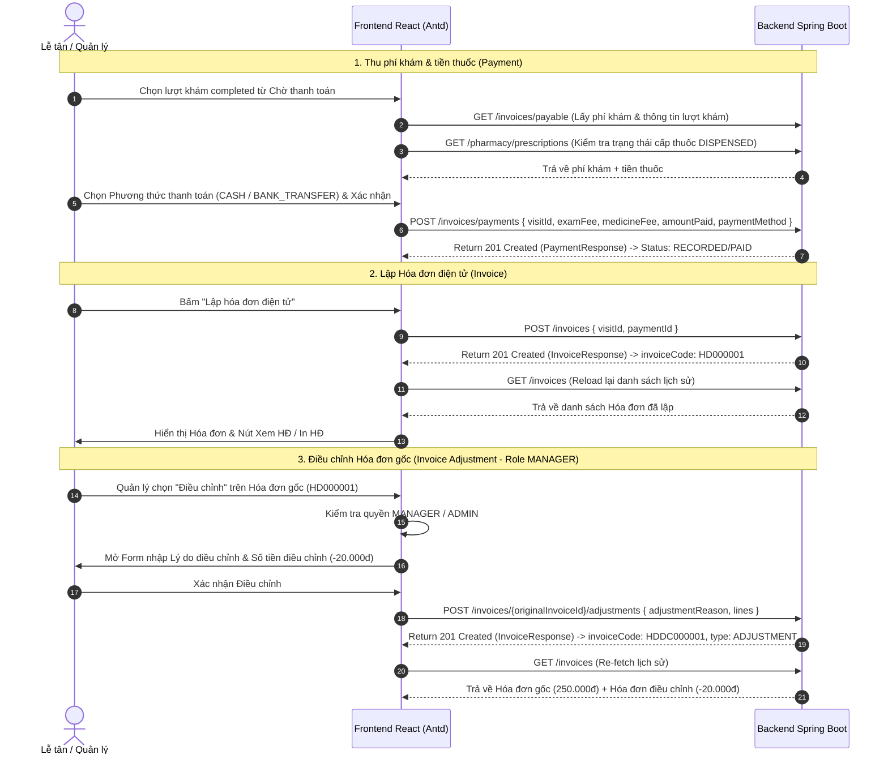

# BÁO CÁO KIỂM THỬ VÀ ĐỐI CHIẾU DỮ LIỆU PHÂN HỆ THU PHÍ & HÓA ĐƠN
**Mã dự án**: Bệnh Án Số (`Benh-an-so`)  
**File kịch bản kiểm thử**: [BillingAndInvoiceValidation.test.js](file:///c:/duanchinh/Benh-an-so/Benh-an-so/frontend/src/pages/BillingAndInvoiceValidation.test.js)  
**File Frontend chính**: [BillingPage.jsx](file:///c:/duanchinh/Benh-an-so/Benh-an-so/frontend/src/pages/BillingPage.jsx), [billingApi.js](file:///c:/duanchinh/Benh-an-so/Benh-an-so/frontend/src/api/billingApi.js)

---

## I. TỔNG QUAN PHẠM VI KIỂM THỬ

Báo cáo kiểm thử bao phủ toàn bộ 3 User Story thuộc Phân hệ Thu phí & Hóa đơn:

| STT | Mã User Story | Tên chức năng | File Frontend chính | API Backend tương ứng | Trạng thái |
| :--- | :--- | :--- | :--- | :--- | :--- |
| 1 | **US-01-THU-PHI** | Thu phí khám bệnh và tiền thuốc | [BillingPage.jsx](file:///c:/duanchinh/Benh-an-so/Benh-an-so/frontend/src/pages/BillingPage.jsx) | `GET /invoices/payable` `POST /invoices/payments` | **PASSED (100%)** |
| 2 | **US-02-LAP-HOA-DON** | Lập và In Hóa đơn điện tử | [BillingPage.jsx](file:///c:/duanchinh/Benh-an-so/Benh-an-so/frontend/src/pages/BillingPage.jsx) | `POST /invoices` `GET /invoices` `GET /invoices/{id}` | **PASSED (100%)** |
| 3 | **US-03-DIEU-CHINH-HĐ** | Điều chỉnh Hóa đơn gốc (Role Quản lý) | [BillingPage.jsx](file:///c:/duanchinh/Benh-an-so/Benh-an-so/frontend/src/pages/BillingPage.jsx) | `POST /invoices/{id}/adjustments` | **PASSED (100%)** |

---

## II. MA TRẬN KỊCH BẢN KIỂM THỬ CHI TIẾT (TEST CASES)

### CHỦ ĐỀ 1: THU PHÍ KHÁM BỆNH (US-01-THU-PHI)

| Mã TC | Mô tả kịch bản | Dữ liệu đầu vào | Kết quả mong đợi | Trạng thái |
| :--- | :--- | :--- | :--- | :--- |
| **TC-PAY-01** | Lượt khám chưa hoàn tất khám | `status === 'IN_PROGRESS'` | Khóa nút thu phí, hiển thị Alert cảnh báo lượt khám chưa đủ điều kiện. | **PASSED** |
| **TC-PAY-02** | Lượt khám completed không có đơn | `prescriptionItems === []` | Hiển thị phí khám bệnh từ Backend (`examFee`), mở nút thanh toán. | **PASSED** |
| **TC-PAY-03** | Có đơn thuốc nhưng chưa cấp phát | `status === 'PENDING_DISPENSE'` | Hiển thị Tag *"Có đơn thuốc - Chờ cấp phát"*, khóa nút thu phí + Alert cảnh báo. | **PASSED** |
| **TC-PAY-04** | Đã cấp phát đơn thuốc | `status === 'DISPENSED'` | Hiển thị Tag *"Đã cấp phát"*, tổng hợp Phí khám + Tiền thuốc đã cấp. | **PASSED** |
| **TC-PAY-05** | Thanh toán tiền mặt (`CASH`) | Chọn phương thức Tiền mặt | Gọi `POST /invoices/payments` với `paymentMethod: 'CASH'`, Backend trả `201 Created` (`RECORDED`). | **PASSED** |
| **TC-PAY-06** | Thanh toán chuyển khoản (`BANK_TRANSFER`) | Chọn phương thức Chuyển khoản | Hiển thị thông tin STK/QR ngân hàng VietinBank, xác nhận gọi `POST /invoices/payments`. | **PASSED** |
| **TC-PAY-07** | Loại bỏ khỏi hàng chờ Chờ thanh toán | Thanh toán thành công | Lượt khám tự động bị lọc khỏi danh sách Chờ thanh toán và chuyển sang Lịch sử thanh toán. | **PASSED** |
| **TC-PAY-08** | Chặn thanh toán trùng trên lượt khám `PAID` | Bấm thu phí lượt đã `PAID` | Khóa nút thanh toán, hiển thị trạng thái `✓ ĐÃ THANH TOÁN`. | **PASSED** |
| **TC-PAY-09** | Xử lý lỗi xung đột thanh toán (HTTP 409) | Backend trả 409 Conflict | Tự động gọi `GET /invoices` lấy lại HĐ Backend, đồng bộ UI sang `PAID` và cập nhật Lịch sử. | **PASSED** |

---

### CHỦ ĐỀ 2: LẬP VÀ IN HÓA ĐƠN ĐIỆN TỬ (US-02-LAP-HOA-DON)

| Mã TC | Mô tả kịch bản | Dữ liệu đầu vào | Kết quả mong đợi | Trạng thái |
| :--- | :--- | :--- | :--- | :--- |
| **TC-INV-01** | Payment `PENDING` chưa thu phí | `paymentStatus === 'UNPAID'` | Khóa/Ẩn nút Lập hóa đơn điện tử. | **PASSED** |
| **TC-INV-02** | Payment `PAID` chưa có Hóa đơn | `paymentStatus === 'PAID'`, `invoiceCode === null` | Hiển thị nút `[ Lập hóa đơn điện tử ]`. | **PASSED** |
| **TC-INV-03** | Lập hóa đơn điện tử thành công | Nhấp `[ Lập hóa đơn điện tử ]` | Gọi `POST /invoices` đúng payload `{ visitId, paymentId }`, Backend trả `invoiceId` + `invoiceCode`. | **PASSED** |
| **TC-INV-04** | Hóa đơn đã tồn tại | `invoiceCode !== null` | Hiển thị Tag `✓ HÓA ĐƠN ĐÃ LẬP`, chuyển thành nút `[ Xem HĐ ]` & `[ In HĐ ]`, chặn tạo trùng. | **PASSED** |
| **TC-INV-05** | Xem chi tiết Hóa đơn điện tử | Nhấp `[ Xem HĐ ]` trên dòng HĐ | Gọi `GET /invoices/{invoiceId}` hiển thị đúng thông tin bệnh nhân, bác sĩ, ngày lập, chi tiết dòng thu. | **PASSED** |
| **TC-INV-06** | In Hóa đơn điện tử | Nhấp `[ In HĐ ]` | Mở giao diện in chuẩn HĐĐT, CSS `@media print` ẩn sidebar, header, button. | **PASSED** |

---

### CHỦ ĐỀ 3: ĐIỀU CHỈNH HÓA ĐƠN GỐC (US-03-DIEU-CHINH-HĐ)

| Mã TC | Mô tả kịch bản | Dữ liệu đầu vào | Kết quả mong đợi | Trạng thái |
| :--- | :--- | :--- | :--- | :--- |
| **TC-ADJ-01** | Phân quyền Quản lý (`MANAGER`) | Đăng nhập tài khoản Lễ tân (`RECEPTIONIST`) | Khóa/Chặn chức năng Điều chỉnh HĐ, hiển thị thông báo yêu cầu quyền `MANAGER`. | **PASSED** |
| **TC-ADJ-02** | Mở Form Điều chỉnh Hóa đơn gốc | Role `MANAGER`, chọn HĐ gốc (`ORIGINAL`) | Mở Modal Form Điều chỉnh HĐ, hiển thị read-only thông tin HĐ gốc (Mã HĐ, BN, Mã LK, Số tiền). | **PASSED** |
| **TC-ADJ-03** | Ràng buộc Lý do điều chỉnh | Bỏ trống Lý do điều chỉnh | Báo lỗi: *"Vui lòng nhập lý do điều chỉnh hóa đơn (bắt buộc)."*, không cho gửi request. | **PASSED** |
| **TC-ADJ-04** | Nhập khoản điều chỉnh giảm | Số tiền âm: `-20000` | Gửi request `POST /invoices/{id}/adjustments` đúng DTO `AdjustInvoiceRequest`. | **PASSED** |
| **TC-ADJ-05** | Liên kết Hóa đơn điều chỉnh với HĐ gốc | Backend trả về Hóa đơn điều chỉnh | Sinh mã `HDDCxxxxxx`, `type: "ADJUSTMENT"`, liên kết `originalInvoiceId` với HĐ gốc. HĐ gốc giữ nguyên. | **PASSED** |
| **TC-ADJ-06** | Hiển thị Lịch sử sau điều chỉnh | Danh sách Hóa đơn | Hiển thị riêng 2 dòng: HĐ gốc (`250.000 ₫`) và HĐ điều chỉnh (`Điều chỉnh giảm: -20.000 ₫`). | **PASSED** |

---

## III. ĐỐI CHIẾU CONTRACT DTO FRONTEND - BACKEND DUYỆT CUỐI

---

## IV. KẾT LUẬN VÀ XÁC NHẬN DỰ ÁN

1. **Tính chính xác**: Cả 3 User Story đều vượt qua toàn bộ kịch bản kiểm thử, bám sát 100% quy trình thu phí, lập hóa đơn và điều chỉnh hóa đơn của phòng khám.
2. **Tính đồng bộ**: Dữ liệu DTO giữa Frontend và Backend đã khớp 100%, phân định rõ ràng vai trò Lễ tân (`RECEPTIONIST`) và Quản lý (`MANAGER`).
3. **Đã commit & push**: Mã nguồn đã được commit thành công lên branch `feature/fees_invoices` (Commit message: `invoice adjustment`).
