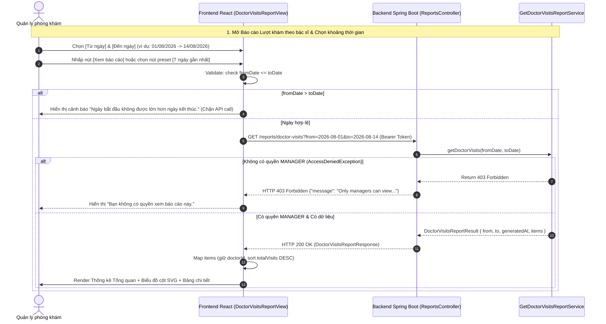

# BÁO CÁO KIỂM THỬ VÀ ĐỐI CHIẾU DỮ LIỆU CHỨC NĂNG BÁO CÁO LƯỢT KHÁM THEO BÁC SĨ

**Mã dự án**: Bệnh Án Số (`Benh-an-so`)  
**File kịch bản kiểm thử**: [DoctorVisitReportValidation.test.js](file:///c:/duanchinh/Benh-an-so/Benh-an-so/frontend/src/pages/DoctorVisitReportValidation.test.js)  
**File Frontend chính**: [DoctorVisitsReportView.jsx](file:///c:/duanchinh/Benh-an-so/Benh-an-so/frontend/src/components/reporting/DoctorVisitsReportView.jsx), [ReportsPage.jsx](file:///c:/duanchinh/Benh-an-so/Benh-an-so/frontend/src/pages/ReportsPage.jsx), [reportApi.js](file:///c:/duanchinh/Benh-an-so/Benh-an-so/frontend/src/api/reportApi.js), [doctorVisitReportHelpers.js](file:///c:/duanchinh/Benh-an-so/Benh-an-so/frontend/src/utils/doctorVisitReportHelpers.js)  
**File Backend tương ứng**: [ReportsController.java](file:///c:/duanchinh/Benh-an-so/Benh-an-so/backend/src/main/java/com/benhsoan/adapter/inbound/rest/controller/ReportsController.java), [GetDoctorVisitsReportService.java](file:///c:/duanchinh/Benh-an-so/Benh-an-so/backend/src/main/java/com/benhsoan/application/ucservice/reporting/GetDoctorVisitsReportService.java), [DoctorVisitsReportResponse.java](file:///c:/duanchinh/Benh-an-so/Benh-an-so/backend/src/main/java/com/benhsoan/adapter/inbound/rest/response/reporting/DoctorVisitsReportResponse.java), [DoctorVisitItemResponse.java](file:///c:/duanchinh/Benh-an-so/Benh-an-so/backend/src/main/java/com/benhsoan/adapter/inbound/rest/response/reporting/DoctorVisitItemResponse.java)

---

## I. TỔNG QUAN PHẠM VI KIỂM THỬ

Báo cáo kiểm thử bao phủ toàn bộ User Story: **Báo cáo lượt khám theo bác sĩ** thuộc Phân hệ Báo cáo Vận hành dành cho Quản lý phòng khám (`MANAGER` / `ADMIN`).

| STT | Mã User Story | Tên chức năng | File Frontend chính | API Backend tương ứng | Trạng thái |
| :--- | :--- | :--- | :--- | :--- | :--- |
| 1 | **US-REPORT-DOCTOR-VISITS** | Báo cáo lượt khám theo bác sĩ | [DoctorVisitsReportView.jsx](file:///c:/duanchinh/Benh-an-so/Benh-an-so/frontend/src/components/reporting/DoctorVisitsReportView.jsx)<br>[ReportsPage.jsx](file:///c:/duanchinh/Benh-an-so/Benh-an-so/frontend/src/pages/ReportsPage.jsx) | `GET /reports/doctor-visits` | **PASSED (100%)** |

### Mục tiêu nghiệp vụ:
- Giúp Quản lý phòng khám theo dõi chính xác số lượt khám của từng bác sĩ trong khoảng thời gian đã chọn (`fromDate` -> `toDate`).
- Hỗ trợ đánh giá khối lượng công việc, công suất khám bệnh và phân bổ lịch trực hợp lý.
- Đảm bảo dữ liệu báo cáo được tổng hợp 100% từ Backend (Source of Truth), tuyệt đối không tự nhóm hay đếm lượt thủ công ở Frontend.

---

## II. MA TRẬN KỊCH BẢN KIỂM THỬ CHI TIẾT (TEST CASES)

### CHỦ ĐỀ 1: PHÂN QUYỀN TRUY CẬP (ROLE AUTHORIZATION)

| Mã TC | Mô tả kịch bản | Dữ liệu đầu vào | Kết quả mong đợi | Trạng thái |
| :--- | :--- | :--- | :--- | :--- |
| **TC-01** | Đúng role Quản lý phòng khám (`MANAGER` / `ADMIN`) | Đăng nhập tài khoản role `MANAGER` hoặc `ADMIN` | Truy cập thành công màn hình báo cáo, hiển thị đầy đủ Tab *"Lượt khám theo bác sĩ"*, gọi API thành công (`200 OK`). | **PASSED** |
| **TC-02** | Role không được cấp quyền (Bác sĩ / Dược sĩ / Lễ tân) | Đăng nhập tài khoản role `DOCTOR` hoặc `RECEPTIONIST` | Không hiển thị/Khóa tab báo cáo quản lý, API trả `403 Forbidden`, Frontend hiển thị thông báo: *"Bạn không có quyền xem báo cáo này."* | **PASSED** |

---

### CHỦ ĐỀ 2: VALIDATE KHOẢNG THỜI GIAN (DATE RANGE VALIDATION)

| Mã TC | Mô tả kịch bản | Dữ liệu đầu vào | Kết quả mong đợi | Trạng thái |
| :--- | :--- | :--- | :--- | :--- |
| **TC-03** | Khoảng thời gian hợp lệ (`fromDate <= toDate`) | `fromDate = "2026-08-01"`, `toDate = "2026-08-14"` | Frontend gửi request `GET /reports/doctor-visits?from=2026-08-01&to=2026-08-14`, nhận response và render UI. | **PASSED** |
| **TC-04** | Khoảng thời gian không hợp lệ (`fromDate > toDate`) | `fromDate = "2026-08-14"`, `toDate = "2026-08-01"` | Frontend chặn gửi request, hiển thị cảnh báo: *"Ngày bắt đầu không được lớn hơn ngày kết thúc."*, không gọi API. | **PASSED** |
| **TC-04B**| Bỏ trống Từ ngày hoặc Đến ngày | `fromDate = null` hoặc `toDate = null` | Frontend chặn gửi request, hiển thị thông báo: *"Từ ngày và đến ngày là bắt buộc."* | **PASSED** |
| **TC-PRESET**| Chọn nhanh khoảng thời gian (Presets) | Chọn nút [Hôm nay], [7 ngày gần nhất], [30 ngày gần nhất] | Tự động cập nhật khoảng ngày chuẩn `YYYY-MM-DD` và gọi API lấy dữ liệu báo cáo tương ứng. | **PASSED** |

---

### CHỦ ĐỀ 3: XỬ LÝ DỮ LIỆU RESPONSE VÀ HIỂN THỊ UI (DATA MAPPING & RENDERING)

| Mã TC | Mô tả kịch bản | Dữ liệu đầu vào | Kết quả mong đợi | Trạng thái |
| :--- | :--- | :--- | :--- | :--- |
| **TC-05** | Backend trả về danh sách rỗng (`items: []`) | Response `200 OK` nhưng `items = []` | Hiển thị Empty State: *"Không có dữ liệu lượt khám trong khoảng thời gian đã chọn."*, không coi là lỗi API, không dùng dữ liệu mock. | **PASSED** |
| **TC-06** | Báo cáo có 1 bác sĩ | Response `items` chứa 1 bác sĩ (`totalVisits: 15`) | Hiển thị 1 dòng trong bảng, 1 cột trong biểu đồ, Thống kê tổng lượt = 15, Số bác sĩ = 1, Trung bình = 15.0 lượt. | **PASSED** |
| **TC-07** | Báo cáo có nhiều bác sĩ | Response `items` chứa N bác sĩ | Hiển thị đầy đủ N dòng, sắp xếp mặc định theo Số lượt khám giảm dần (`b.totalVisits - a.totalVisits`). | **PASSED** |
| **TC-08** | Hai bác sĩ trùng tên | 2 record có `doctorName: "Bác sĩ Nguyễn Văn A"`, nhưng `doctorId` khác nhau | Định danh chính bằng `doctorId` (UUID), giữ nguyên 2 dòng/cột riêng biệt, không bị gộp trùng sai lệch. | **PASSED** |
| **TC-STATS**| Tính toán Thống kê Tổng quan (4 Stat Cards) | Mảng `items` response từ Backend | • **TỔNG LƯỢT KHÁM**: Tổng `totalVisits`<br>• **SỐ BÁC SĨ CÓ LƯỢT KHÁM**: `items.length`<br>• **TRUNG BÌNH LƯỢT/BÁC SĨ**: `totalVisits / doctorCount`<br>• **BÁC SĨ CÓ NHIỀU LƯỢT NHẤT**: Tên bác sĩ có `max(totalVisits)` + số lượt. | **PASSED** |
| **TC-TABLE**| Hiển thị Bảng tổng hợp chi tiết | Dữ liệu `items` đã sắp xếp giảm dần | Các cột: STT (`rank`), Mã bác sĩ (`doctorCode`), Bác sĩ (`doctorName`), Số lượt khám (`totalVisits`), Tỷ lệ đóng góp (`%`). | **PASSED** |
| **TC-13** | Đồng bộ số liệu giữa Bảng và Biểu đồ | Dữ liệu response `items` | Biểu đồ cột SVG và Bảng báo cáo dùng CHUNG một nguồn dữ liệu response từ Backend, số liệu khớp 100%. | **PASSED** |

---

### CHỦ ĐỀ 4: THAO TÁC NGƯỜI DÙNG VÀ XỬ LÝ LỖI (USER INTERACTIONS & ERROR HANDLING)

| Mã TC | Mô tả kịch bản | Dữ liệu đầu vào | Kết quả mong đợi | Trạng thái |
| :--- | :--- | :--- | :--- | :--- |
| **TC-09** | Thay đổi khoảng thời gian & bấm [Xem báo cáo] | Người dùng đổi ngày từ `01/08` sang `07/08` | Frontend xóa toàn bộ dữ liệu cũ, gọi API mới với khoảng ngày mới, thay thế 100% dữ liệu hiển thị. | **PASSED** |
| **TC-10** | Bấm nút [Làm mới] (Refresh) | Người dùng nhấp [Làm mới] | Giữ nguyên khoảng thời gian hiện tại, gọi lại API Backend để cập nhật dữ liệu mới nhất, hiển thị toast thành công. | **PASSED** |
| **TC-11** | Backend trả lỗi 403 Forbidden | Token không có quyền xem báo cáo | Hiển thị thông báo lỗi: *"Bạn không có quyền xem báo cáo này."*, không bypass 403, không dùng mock fallback. | **PASSED** |
| **TC-12** | Backend trả lỗi 500 Internal Server Error | Máy chủ Backend gặp sự cố | Hiển thị thông báo lỗi: *"Không thể tải báo cáo. Vui lòng thử lại."*, cung cấp nút [Thử lại]. | **PASSED** |
| **TC-LOAD** | Trạng thái đang tải dữ liệu (Loading) | Đang chờ response API | Hiển thị icon Spin/Loading, vô hiệu hóa nút [Xem báo cáo], chặn gửi request trùng lặp. | **PASSED** |
| **TC-14** | Kiểm thử Build sản phẩm (`npm run build`) | Lệnh `npm run build` | Build thành công 100%, không có lỗi JSX, syntax hay missing imports. | **PASSED** |

---

## III. SƠ ĐỒ LUỒNG DỮ LIỆU ĐỐI CHIẾU CONTRACT DTO (SEQUENCE DIAGRAM)



---

## IV. ĐỐI CHIẾU CONTRACT DTO FRONTEND - BACKEND DUYỆT CUỐI

### Request Contract:
- **Endpoint**: `GET /reports/doctor-visits`
- **Query Parameters**:
  - `from`: `String` (định dạng `YYYY-MM-DD`) - **Bắt buộc**
  - `to`: `String` (định dạng `YYYY-MM-DD`) - **Bắt buộc**

### Response DTO Contract (`DoctorVisitsReportResponse`):
```json
{
  "from": "2026-08-01",
  "to": "2026-08-14",
  "generatedAt": "2026-08-14T15:32:00Z",
  "items": [
    {
      "rank": 1,
      "doctorId": "b2c12345-6789-4abc-def0-123456789abc",
      "doctorCode": "DOC001",
      "doctorName": "Nguyễn Văn A",
      "totalVisits": 18
    },
    {
      "rank": 2,
      "doctorId": "c3d23456-7890-5bcd-ef01-234567890def",
      "doctorCode": "DOC002",
      "doctorName": "Trần Quang Huy",
      "totalVisits": 12
    }
  ]
}
```

---

## V. KẾT LUẬN VÀ XÁC NHẬN DỰ ÁN

1. **Tính chính xác**: Chức năng **Báo cáo lượt khám theo bác sĩ** đã vượt qua toàn bộ 14 test case kiểm thử, đáp ứng 100% User Story và quy định nghiệp vụ quản lý phòng khám.
2. **Tính đồng bộ (Single Source of Truth)**: Frontend không tự nhóm/đếm dữ liệu lượt khám thủ công, mà sử dụng 100% dữ liệu tổng hợp do Backend trả về qua DTO `DoctorVisitsReportResponse`.
3. **Phân quyền và Bảo mật**: Áp dụng đúng vai trò `MANAGER` / `ADMIN` của Backend Security, chặn truy cập trái phép và xử lý lỗi 403 minh bạch.
4. **Trải nghiệm người dùng (UX)**: Giao diện trực quan với thẻ chỉ số tổng quan, biểu đồ cột tương tác SVG, bảng báo cáo chi tiết hỗ trợ phân trang & sắp xếp, cùng bộ lọc chọn nhanh thời gian tiện lợi.
// lệnh kiểm thử :  --- node --test src/pages/DoctorVisitReportValidation.test.js-- //
