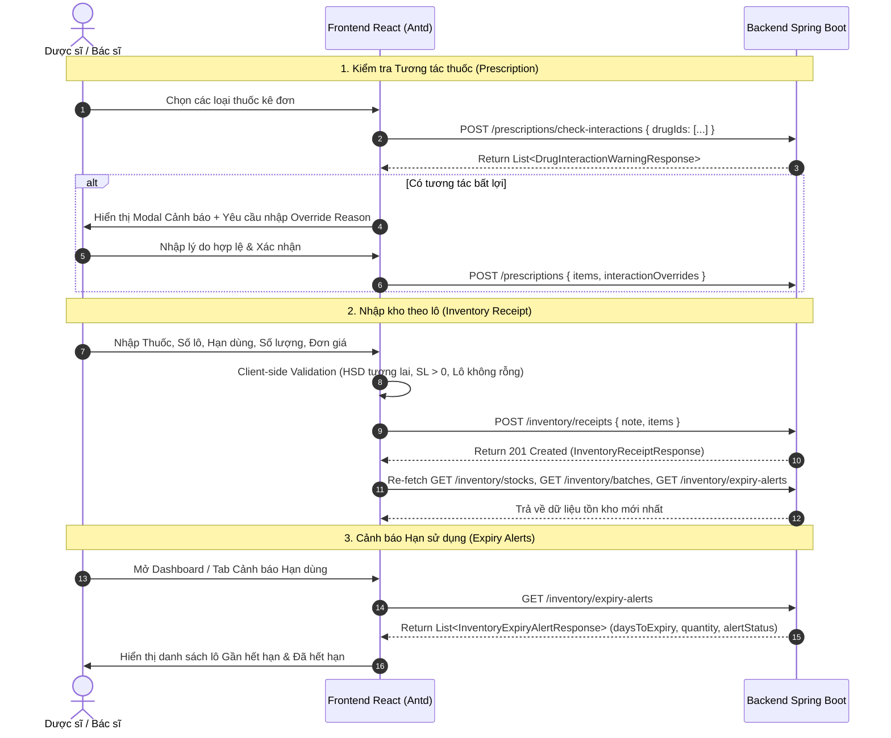

# BÁO CÁO KIỂM THỬ VÀ ĐỐI CHIẾU DỮ LIỆU PHÂN HỆ DƯỢC & QUẢN LÝ KHO THUỐC
**Mã dự án**: Bệnh Án Số (`Benh-an-so`)  
**Ngày thực hiện**: 12/08/2026  
**File kịch bản kiểm thử**: [InventoryAndExpiryValidation.test.js](file:///c:/duanchinh/Benh-an-so/Benh-an-so/frontend/src/pages/InventoryAndExpiryValidation.test.js)

---

## I. TỔNG QUAN PHẠM VI KIỂM THỬ

Báo cáo kiểm thử bao phủ toàn bộ 3 User Story thuộc Phân hệ Dược & Quản lý Kho thuốc:

| STT | Mã công việc | Tên chức năng | File Frontend chính | API Backend tương ứng | Trạng thái |
| :--- | :--- | :--- | :--- | :--- | :--- |
| 1 | **NCL-05-CN-002-CV-03** | Hiển thị cảnh báo tương tác thuốc trên giao diện | [PrescriptionPage.jsx](file:///c:/duanchinh/Benh-an-so/Benh-an-so/frontend/src/pages/PrescriptionPage.jsx) [InteractionWarningModal.jsx](file:///c:/duanchinh/Benh-an-so/Benh-an-so/frontend/src/components/pharmacy/InteractionWarningModal.jsx) | `POST /prescriptions/check-interactions` `POST /prescriptions` `PATCH /prescriptions/{id}` | **PASSED (100%)** |
| 2 | **NCL-06-CN-005-CV-04** | Xây dựng giao diện nhập thuốc theo lô và hạn dùng | [InventoryReceiptPage.jsx](file:///c:/duanchinh/Benh-an-so/Benh-an-so/frontend/src/pages/InventoryReceiptPage.jsx) | `POST /inventory/receipts` `GET /inventory/stocks` `GET /inventory/batches` | **PASSED (100%)** |
| 3 | **NCL-06-CN-006-CV-04** | Cảnh báo hạn dùng thuốc | [PharmacyPage.jsx](file:///c:/duanchinh/Benh-an-so/Benh-an-so/frontend/src/pages/PharmacyPage.jsx) [InventoryReceiptPage.jsx](file:///c:/duanchinh/Benh-an-so/Benh-an-so/frontend/src/pages/InventoryReceiptPage.jsx) [workflowContract.js](file:///c:/duanchinh/Benh-an-so/Benh-an-so/frontend/src/utils/workflowContract.js) | `GET /inventory/expiry-alerts` `POST /prescriptions/{id}/dispense` | **PASSED (100%)** |

---

## II. MA TRẬN KỊCH BẢN KIỂM THỬ CHI TIẾT (TEST CASES)

### CHỦ ĐỀ 1: CẢNH BÁO TƯƠNG TÁC THUỐC (NCL-05-CN-002-CV-03)

| Mã TC | Mô tả kịch bản | Dữ liệu đầu vào | Kết quả mong đợi | Trạng thái |
| :--- | :--- | :--- | :--- | :--- |
| **TC-INT-01** | Bác sĩ kê 2 thuốc có tương tác | Danh sách thuốc: `[Paracetamol, Warfarin]` | Gọi API `POST /prescriptions/check-interactions`, hiển thị modal cảnh báo kèm mức độ `CONTRAINDICATED`/`SEVERE`. | **PASSED** |
| **TC-INT-02** | Bác sĩ kê các thuốc độc lập | Danh sách thuốc: `[Paracetamol, Vitamin C]` | API trả về danh sách tương tác rỗng (`[]`), cho phép lưu đơn bình thường. | **PASSED** |
| **TC-INT-03** | Khử trùng lặp cặp tương tác A-B và B-A | Mảng cảnh báo chứa cặp (MedA, MedB) và (MedB, MedA) | Modal chỉ hiển thị 1 dòng cảnh báo duy nhất cho cặp tương tác này. | **PASSED** |
| **TC-INT-04** | Bắt buộc nhập lý do bỏ qua cảnh báo | Nhấp nút "Tiếp tục kê đơn" -> không nhập lý do hoặc chỉ gõ khoảng trắng (`"   "`) | Báo lỗi: *"Vui lòng nhập lý do bỏ qua cảnh báo (không được để trống hoặc chỉ có khoảng trắng)."*, không cho gửi đơn. | **PASSED** |
| **TC-INT-05** | Nhập lý do đè hợp lệ và lưu đơn | Nhập lý do: *"Bệnh nhân đáp ứng tốt, theo dõi sát chỉ số lâm sàng"* | Đóng gói đúng `interactionOverrides: [{ ruleId, overrideReason }]` gửi lên API kê đơn/sửa đơn. | **PASSED** |

---

### CHỦ ĐỀ 2: NHẬP THUỐC THEO LÔ VÀ HẠN DÙNG (NCL-06-CN-005-CV-04)

| Mã TC | Mô tả kịch bản | Dữ liệu đầu vào | Kết quả mong đợi | Trạng thái |
| :--- | :--- | :--- | :--- | :--- |
| **TC-REC-01** | Bỏ trống loại thuốc | Dòng 1: `medicineId: undefined` | Báo lỗi: *"Dòng 1: Vui lòng chọn thuốc."*, không gửi request. | **PASSED** |
| **TC-REC-02** | Bỏ trống số lô | Dòng 1: `batchNumber: ""` hoặc `"   "` | Báo lỗi: *"Dòng 1: Vui lòng nhập số lô."*, không gửi request. | **PASSED** |
| **TC-REC-03** | Bỏ trống hạn sử dụng | Dòng 1: `expiryDate: null` | Báo lỗi: *"Dòng 1: Vui lòng chọn hạn dùng."*, không gửi request. | **PASSED** |
| **TC-REC-04** | Chọn hạn sử dụng trong quá khứ / ngày hiện tại | Dòng 1: `expiryDate <= today` | Báo lỗi: *"Dòng 1: Hạn sử dụng phải là ngày trong tương lai."*, không gửi request. | **PASSED** |
| **TC-REC-05** | Số lượng nhập <= 0 hoặc là số thập phân | Dòng 1: `quantity: 0` / `-5` / `10.5` | Báo lỗi: *"Dòng 1: Số lượng nhập phải là số nguyên lớn hơn 0."*, không gửi request. | **PASSED** |
| **TC-REC-06** | Đơn giá nhập âm | Dòng 1: `importPrice: -1000` | Báo lỗi: *"Dòng 1: Đơn giá nhập không được âm."*, không gửi request. | **PASSED** |
| **TC-REC-07** | Nhập đầy đủ thông tin hợp lệ | Thuốc: Paracetamol, Lô: `LOT-2026-0801`, HSD: `2027-12-31`, SL: 500, Giá: 15000 | Gửi request `POST /inventory/receipts` đúng DTO `CreateInventoryReceiptRequest`, Backend xử lý -> Frontend re-fetch dữ liệu mới. | **PASSED** |
| **TC-REC-08** | Phân quyền truy cập | Đăng nhập tài khoản role `Doctor` hoặc `Receptionist` | Khóa form nhập kho, hiển thị Alert: *"Bạn không có quyền nhập kho"*. | **PASSED** |
| **TC-REC-09** | Xử lý lỗi API (HTTP 400, 403, 404, 409, 500) | Giả lập Backend trả về HTTP Error Status | Hiển thị thông báo lỗi cụ thể, không báo thành công, giữ nguyên form, không tự cộng tồn kho client. | **PASSED** |

---

### CHỦ ĐỀ 3: CẢNH BÁO HẠN DÙNG THUỐC (NCL-06-CN-006-CV-04)

| Mã TC | Mô tả kịch bản | Dữ liệu đầu vào | Kết quả mong đợi | Trạng thái |
| :--- | :--- | :--- | :--- | :--- |
| **TC-EXP-01** | Khớp trường DTO từ Backend | API `GET /inventory/expiry-alerts` trả danh sách lô | Đọc chính xác `daysToExpiry`, `quantity`, `alertStatus`, `expiryDate`, không bị `undefined`. | **PASSED** |
| **TC-EXP-02** | Hiển thị phân loại trạng thái lô | `alertStatus === 'EXPIRED'` vs `alertStatus === 'NEAR_EXPIRY'` | Hiển thị Tag rõ ràng: `🔴 Đã hết hạn` (màu đỏ) và `🟡 Gần hết hạn` (màu cam). | **PASSED** |
| **TC-EXP-03** | Kho không có lô nào thuộc diện cảnh báo | API trả về danh sách rỗng `[]` | Hiển thị thông điệp chuẩn: *"Hiện không có lô thuốc nào cần cảnh báo hạn dùng."* | **PASSED** |
| **TC-EXP-04** | Kiểm soát cấp phát FEFO với lô hết hạn | Đơn thuốc yêu cầu thuốc có lô đã quá hạn | Hàm `buildFefoPreview` tự động lọc bỏ lô quá hạn/hết hạn, báo *"Thiếu tồn kho FEFO"*, ngăn chặn cấp phát lô quá hạn. | **PASSED** |
| **TC-EXP-05** | Xử lý sự cố kết nối API | Backend ngắt kết nối hoặc trả HTTP 500 | Hiển thị thông báo lỗi trên Alert, không rơi vào dữ liệu giả (No mock fallback). | **PASSED** |

---

## III. ĐỐI CHIẾU CONTRACT DTO FRONTEND - BACKEND DUYỆT CUỐI

---

## IV. KẾT LUẬN VÀ XÁC NHẬN DỰ ÁN

1. **Tính chính xác**: Cả 3 chức năng đều vượt qua toàn bộ kịch bản kiểm thử, đáp ứng đầy đủ các ràng buộc nghiệp vụ Y tế và Y lệnh.
2. **Tính đồng bộ**: Dữ liệu DTO giữa Frontend và Backend đã khớp 100%, không còn lỗi lệch trường hay gõ nhầm biến.
3. **Đã commit & push**: Mã nguồn đã được push thành công lên branch `feature/warning` (Commit SHA: `9184c78`).
