# KẾ HOẠCH TRIỂN KHAI BACKEND: DỰ TRÙ MUA THUỐC VÀ PHIẾU ĐẶT HÀNG (NCL-06-CN-012)

> **Phân hệ (Epic):** `NCL-06` — Quản lý kho thuốc và cấp phát  
> **User Story:** `NCL-06-CN-012` — Dự trù mua thuốc và phiếu đặt hàng  
> **Quy tắc nghiệp vụ liên quan:** `QTN-06` (Không cấp phát vượt tồn kho), `QTN-01` (Phân quyền truy cập theo vai trò), `QTN-31` (Ghi nhật ký thao tác quản trị & kiểm toán), Quy tắc Phân tách nhiệm vụ (Separation of Duties - SoD), Quy tắc Bất biến chứng từ (Immutability)  
> **Tiêu chí chấp nhận (AC):** `NCL-06-CN-012-TC-01`, `NCL-06-CN-012-TC-02`, `NCL-06-CN-012-TC-03`  
> **Nhiệm vụ liên quan (Tasks):** `NCL-06-CN-012-CV-01` đến `NCL-06-CN-012-CV-05`  
> **Phạm vi:** Phân tích toàn diện và lập kế hoạch kỹ thuật cho Backend; chưa triển khai code; không thay đổi Frontend.

---

## 1. Yêu cầu cần người dùng / Tech Lead xem xét và chốt (User Review Required)

> [!IMPORTANT]
> **Quyết định 1: Công thức thuật toán gợi ý số lượng cần mua (`suggestedQuantity`)**  
> Trong mô tả User Story: *"Hệ thống gợi ý số lượng cần mua từ tồn hiện tại, tồn tối thiểu và lượng cấp phát kỳ trước, dược sĩ điều chỉnh rồi tạo phiếu dự trù gửi quản lý phòng khám."*  
> Công thức toán học chuẩn hóa được áp dụng:
> $$\text{Số lượng gợi ý} = \max\Big(0,\ \big(\text{Lượng cấp phát kỳ trước} + \text{Ngưỡng tồn tối thiểu}\big) - \text{Tồn khả dụng hợp lệ}\Big)$$
> - **Lượng cấp phát kỳ trước:** Tổng lượng thuốc đã cấp phát trong chu kỳ tham chiếu (mặc định 30 ngày gần nhất, hoặc khoảng thời gian từ ngày `from` đến ngày `to` do Dược sĩ tùy chọn) lấy từ báo cáo cấp phát thuốc (`OperationalReportQueryRepository.findTopDispensedMedicines`).
> - **Tồn khả dụng hợp lệ (`eligibleStockQuantity`):** Tổng tồn từ các lô thuốc còn hạn sử dụng tính đến ngày tham chiếu (`LowStockEvaluator.calculateEligibleStockQuantity`), thay vì chỉ lấy tổng tồn sổ sách (`stock_quantity`) nhằm tránh tính nhầm các lô thuốc đã hết hạn vào tồn khả dụng.
> - **Ngưỡng tồn tối thiểu:** Giá trị `min_stock_threshold` đã được cấu hình trên danh mục thuốc (`medicines`) theo story phụ thuộc `NCL-06-CN-007`.
> - Dược sĩ được toàn quyền điều chỉnh số lượng đề nghị mua (`proposedQuantity`) trước khi gửi phiếu.

> [!WARNING]
> **Quyết định 2: Quy tắc phân tách trách nhiệm (Separation of Duties - SoD) khi phê duyệt phiếu**  
> Dược sĩ (`PHARMACIST`) là người lập và gửi duyệt phiếu dự trù. Quản lý phòng khám (`MANAGER`) là người xem xét và phê duyệt (`APPROVED`) hoặc từ chối (`REJECTED`).  
> Nhằm đảm bảo kiểm soát nội bộ và tính minh bạch tài chính: **Người tạo phiếu tuyệt đối không được phép tự phê duyệt hoặc tự từ chối phiếu dự trù do chính mình lập** (tương tự như quy định phê duyệt giảm giá `QTN-37`). Nếu vi phạm, hệ thống ném ngoại lệ `SelfProcurementApprovalNotAllowedException` và trả về mã lỗi `403 Forbidden`.

> [!NOTE]
> **Quyết định 3: Mã phiếu định danh và Tính bất biến của chứng từ**  
> - Mã phiếu dự trù mua thuốc được cấp tự động theo mẫu chuẩn hóa: `DT` + 6 chữ số tuần tự (ví dụ: `DT000001`, `DT000002`...) thông qua bảng chuỗi số nguyên tử `medication_procurement_code_sequences` với cơ chế `LAST_INSERT_ID()`.
> - Khi phiếu ở trạng thái kết thúc `APPROVED` (Đã duyệt) hoặc `REJECTED` (Đã từ chối): Toàn bộ thông tin dòng thuốc, số lượng và thông tin phê duyệt sẽ trở thành **bất biến** (ném lỗi `409 Conflict` nếu cố tình sửa hoặc hủy).

> [!NOTE]
> **Quyết định 4: Xử lý hiệu năng truy vấn phân trang danh sách phiếu (N+1 Query Issue)**  
> Hiện tại trong `MedicationProcurementPlanRepositoryAdapter.findAll`, sau khi truy vấn trang các `MedicationProcurementPlanEntity`, adapter đang gọi thêm `jpaItemRepository.findByPlanIdOrderByCreatedAtAsc(planEntity.getId())` cho từng bản ghi. Với API danh sách tóm tắt (`GET /inventory/procurements`), toàn bộ thông tin thống kê (`totalItems`, `totalProposedQuantity`, `totalApprovedQuantity`) đã có sẵn trên bảng cha `medication_procurement_plans`. Cần tối ưu để không tải chi tiết item khi chỉ hiển thị danh sách tóm tắt.

---

## 2. Phân tích chi tiết yêu cầu nghiệp vụ và các điều kiện áp dụng

### 2.1. Phân tích vai trò và ma trận phân quyền (Roles & Permissions)

Căn cứ theo sheet `User Roles (Vai trò)` và `Product Backlog`:
* **Dược sĩ (`VT-04` - `PHARMACIST`):**
  - **Mục tiêu:** Quản lý kho thuốc, cấp phát thuốc đúng đơn và kiểm soát tồn kho không bị đứt gãy.
  - **Quyền hạn cấp:**
    - `MEDICATION_PROCUREMENT_READ`: Xem gợi ý số lượng cần mua, xem danh sách và chi tiết phiếu dự trù.
    - `MEDICATION_PROCUREMENT_CREATE`: Lập phiếu dự trù mới (lưu nháp `DRAFT` hoặc gửi duyệt `PENDING_APPROVAL`), cập nhật phiếu nháp, gửi duyệt (`SUBMIT`), hủy phiếu (`CANCEL`).
* **Quản lý phòng khám (`VT-01` - `MANAGER`):**
  - **Mục tiêu:** Điều hành phòng khám, theo dõi vận hành, cân đối ngân sách và phê duyệt mua sắm.
  - **Quyền hạn cấp:**
    - `MEDICATION_PROCUREMENT_READ`: Xem danh sách toàn bộ phiếu dự trù của kho, xem chi tiết từng dòng thuốc và lịch sử tiêu thụ.
    - `MEDICATION_PROCUREMENT_APPROVE`: Phê duyệt phiếu dự trù (`APPROVED`), điều chỉnh số lượng duyệt từng thuốc nếu cần, hoặc từ chối (`REJECTED` kèm lý do bắt buộc $\ge 5$ ký tự).
* **Quản trị viên (`VT-05` - `ADMIN`):**
  - Toàn quyền (`MEDICATION_PROCUREMENT_READ`, `MEDICATION_PROCUREMENT_CREATE`, `MEDICATION_PROCUREMENT_APPROVE`). Tuy nhiên vẫn bị ràng buộc bởi quy tắc SoD (nếu Admin là người tạo phiếu thì Admin đó không được tự duyệt phiếu của mình).
* **Lễ tân (`VT-03` - `RECEPTIONIST`) & Bác sĩ (`VT-02` - `DOCTOR`) & Bệnh nhân (`PATIENT`):**
  - Hoàn toàn **không có quyền** can thiệp vào quy trình dự trù và mua thuốc. Khi cố tình gọi API sẽ bị từ chối truy cập với lỗi `403 Forbidden` và hệ thống tự động ghi nhận nhật ký kiểm toán `ACCESS_DENIED` (`TC-03`).

### 2.2. Điều kiện tiên quyết (Preconditions)
* Danh mục thuốc (`medicines`) đã được khởi tạo, có trạng thái hoạt động (`active = true`), có cấu hình ngưỡng tồn tối thiểu (`min_stock_threshold` theo `NCL-06-CN-007`).
* Đã có dữ liệu tồn kho thực tế (`stock_quantity`) và các lô thuốc (`medicine_batches`) để tính toán tồn kho khả dụng còn hạn dùng.
* Đã có lịch sử cấp phát thuốc của ít nhất một kỳ tham chiếu ghi nhận trong `prescription_dispense_items` hoặc thông qua module báo cáo vận hành (`findTopDispensedMedicines` theo `NCL-08-CN-006` / `NCL-06-CN-003`).

### 2.3. Tiêu chí chấp nhận (Acceptance Criteria)
* **`NCL-06-CN-012-TC-01` (Luồng gợi ý số lượng thành công):**
  - *Given:* Có thuốc dưới ngưỡng tồn tối thiểu và có lịch sử cấp phát kỳ trước.
  - *When:* Dược sĩ mở chức năng dự trù mua thuốc (`GET /inventory/procurements/suggestions`).
  - *Then:* Hệ thống trả về gợi ý số lượng cần mua cho từng thuốc kèm thông tin tồn hiện tại, tồn tối thiểu, lượng cấp phát kỳ trước và số lượng gợi ý.
  - *Test Data:* Tồn hiện tại, tồn tối thiểu, lượng cấp phát kỳ trước.
* **`NCL-06-CN-012-TC-02` (Luồng gửi phiếu dự trù chờ duyệt thành công):**
  - *Given:* Dược sĩ đã điều chỉnh số lượng đề nghị mua theo nhu cầu thực tế.
  - *When:* Dược sĩ gửi phiếu dự trù (`POST /inventory/procurements` với `submitImmediately=true` hoặc `POST /inventory/procurements/{id}/submit`).
  - *Then:* Phiếu được tạo/chuyển trạng thái sang `PENDING_APPROVAL` (Chờ duyệt) và hiển thị trên danh sách chờ duyệt của Quản lý phòng khám.
  - *Test Data:* Phiếu dự trù, danh sách thuốc và số lượng đề nghị.
* **`NCL-06-CN-012-TC-03` (Bảo mật & Từ chối quyền Lễ tân):**
  - *Given:* Người đăng nhập là lễ tân (`RECEPTIONIST`).
  - *When:* Mở chức năng / gọi bất kỳ API nào của dự trù mua thuốc.
  - *Then:* Hệ thống từ chối truy cập (HTTP 403 Forbidden) và tự động ghi nhận nhật ký kiểm toán `ACCESS_DENIED`.
  - *Test Data:* Tài khoản lễ tân.

### 2.4. Quy tắc nghiệp vụ áp dụng (Business Rules)
* **`QTN-06` (Không cấp phát vượt tồn kho):** Việc lập dự trù và mua thuốc đúng số lượng giúp kho luôn duy trì cơ số thuốc trên mức tồn tối thiểu, phòng tránh tình trạng cạn kiệt thuốc khi cấp phát cho bệnh nhân.
* **`QTN-01` (Phân quyền truy cập theo vai trò):** Mỗi vai trò chỉ truy cập đúng phạm vi chức năng được phép. Kiểm soát nghiêm ngặt bằng Spring Security kết hợp `@RequirePermission`.
* **`QTN-31` (Ghi nhật ký thao tác quản trị & kiểm toán):** Mọi hành động làm thay đổi dữ liệu phiếu (tạo mới, cập nhật, gửi duyệt, phê duyệt, từ chối, hủy) đều phải ghi nhật ký kiểm toán với snapshot JSON trước/sau, định danh người thực hiện và thời gian chính xác.
* **Quy tắc Phân tách nhiệm vụ (Separation of Duties - SoD):** Người tạo phiếu không được tự phê duyệt hoặc từ chối phiếu của chính mình.
* **Quy tắc Bất biến chứng từ (Data Immutability):** Phiếu sau khi đã `APPROVED` hoặc `REJECTED` thì không được phép chỉnh sửa hoặc xóa/hủy.

---

## 3. Rà soát Codebase hiện tại (As-Is Architecture Review)

Mô hình kiến trúc tổng thể của luồng dự trù mua thuốc trong backend hiện nay:

```mermaid
flowchart TD
    Client([Client / Frontend])
    
    subgraph Inbound_Adapter["Inbound Adapter (REST & Security)"]
        Controller["MedicationProcurementController\n(/inventory/procurements)"]
        Aspect["RequirePermissionAspect\n(@RequirePermission)"]
        RestMapper["MedicationProcurementRestMapper"]
    end

    subgraph Application_Layer["Application Use Cases & Services"]
        SugService["GetMedicationProcurementSuggestionService"]
        Calculator["MedicationProcurementSuggestionCalculator"]
        CreateService["CreateMedicationProcurementPlanService"]
        UpdateService["UpdateMedicationProcurementPlanService"]
        ApproveService["ApproveMedicationProcurementPlanService"]
        RejectService["RejectMedicationProcurementPlanService"]
        GetService["GetMedicationProcurementPlanService"]
        ListService["ListMedicationProcurementPlansService"]
        ResultMapper["MedicationProcurementResultMapper"]
    end

    subgraph Domain_Layer["Domain Core"]
        Plan["MedicationProcurementPlan\n(Aggregate Root)"]
        Item["MedicationProcurementItem\n(Entity)"]
        StatusEnum["ProcurementPlanStatus\n(DRAFT, PENDING_APPROVAL, APPROVED, REJECTED, CANCELLED)"]
        DomainExceptions["Domain Exceptions\n(SelfProcurementApproval, DuplicateMedicine, NotFound, InvalidStatus)"]
    end

    subgraph Outbound_Adapter["Outbound Adapters & Persistence"]
        PlanRepoAdapter["MedicationProcurementPlanRepositoryAdapter"]
        SeqRepoAdapter["MedicationProcurementCodeSequenceRepositoryAdapter"]
        CodeGenerator["DatabaseMedicationProcurementCodeGenerator"]
        AuditAdapter["AuditLogRepositoryAdapter"]
        EligibleStock["EligibleStockSnapshotService"]
        ReportQuery["OperationalReportQueryRepository"]
    end

    subgraph Database["MySQL Database 8.x"]
        DB_Plans[("medication_procurement_plans")]
        DB_Items[("medication_procurement_items")]
        DB_Seq[("medication_procurement_code_sequences")]
        DB_Audit[("audit_logs")]
    end

    Client --> Controller
    Controller --> Aspect
    Controller --> RestMapper
    Controller --> Application_Layer
    
    SugService --> Calculator
    SugService --> EligibleStock
    SugService --> ReportQuery
    
    CreateService --> Plan
    CreateService --> CodeGenerator
    CreateService --> PlanRepoAdapter
    CreateService --> AuditAdapter

    ApproveService --> Plan
    ApproveService --> PlanRepoAdapter
    ApproveService --> AuditAdapter

    RejectService --> Plan
    RejectService --> PlanRepoAdapter
    RejectService --> AuditAdapter

    UpdateService --> Plan
    UpdateService --> PlanRepoAdapter

    PlanRepoAdapter --> DB_Plans
    PlanRepoAdapter --> DB_Items
    SeqRepoAdapter --> DB_Seq
    AuditAdapter --> DB_Audit
```



### Chi tiết các tầng trong Codebase:

1. **Controller Layer:**
   - `MedicationProcurementController.java` tại `com.benhsoan.adapter.inbound.rest.controller`
   - Định tuyến chuẩn: `/inventory/procurements`
   - Đầy đủ 9 API endpoints quản trị vòng đời phiếu.
2. **Request / Mapper Layer:**
   - DTOs: `CreateProcurementPlanRequest.java`, `UpdateProcurementPlanRequest.java`, `ApproveProcurementPlanRequest.java`, `RejectProcurementPlanRequest.java`, `CreateProcurementPlanItemRequest.java`.
   - `MedicationProcurementRestMapper.java` ánh xạ Request/Response DTO với Command/Result.
3. **Use Case / Service Layer:**
   - Đầy đủ 7 Use Case interfaces và Service implementations tương ứng trong `com.benhsoan.application.ucservice.inventory`.
   - Đã tích hợp logic tính gợi ý, SoD check, Audit log.
4. **Domain Layer:**
   - `MedicationProcurementPlan.java`: State machine đóng gói chặt chẽ các hành động `createDraft`, `createAndSubmit`, `submit`, `approve`, `reject`, `cancel`, `update`.
   - `MedicationProcurementItem.java`: Dòng thuốc chi tiết.
   - Các exception nghiệp vụ: `ProcurementPlanNotFoundException`, `ProcurementPlanInvalidStatusException`, `ProcurementPlanEmptyItemsException`, `ProcurementPlanDuplicateMedicineException`, `SelfProcurementApprovalNotAllowedException`.
5. **Persistence / Database Layer:**
   - `V87__create_medication_procurement_tables.sql`: Đầy đủ DDL, index, CHECK constraints, sequence table, seed permissions và gán role.
   - JPA Entities: `MedicationProcurementPlanEntity`, `MedicationProcurementItemEntity`.
   - Repositories & Adapters: `JpaMedicationProcurementPlanRepository`, `JpaMedicationProcurementItemRepository`, `MedicationProcurementPlanRepositoryAdapter`, `MedicationProcurementCodeSequenceRepositoryAdapter`.
6. **Security & Audit:**
   - Quyền: `MEDICATION_PROCUREMENT_READ`, `MEDICATION_PROCUREMENT_CREATE`, `MEDICATION_PROCUREMENT_APPROVE`.
   - `RequirePermissionAspect` xử lý bắt quyền và tự động ghi log `ACCESS_DENIED`.
   - Các service ghi nhận JSON audit log đầy đủ khi `CREATE`, `UPDATE`, `SUBMIT`, `CANCEL`, `APPROVE`, `REJECT`.
7. **Test Layer:**
   - Đã có 27 tests tự động bao phủ Unit và Security Integration, đều chạy thành công 100%.

---

## 4. Đối chiếu giữa Workbook và Codebase hiện có (Gap Analysis)

| Hạng mục | Trong Workbook (`project-workbook.xlsx`) | Trong Codebase hiện tại | Đánh giá & Khoảng hở (Gap) |
| :--- | :--- | :--- | :--- |
| **Gợi ý mua thuốc (`TC-01`)** | Hệ thống gợi ý số lượng cần mua từ tồn hiện tại, tồn tối thiểu và lượng cấp phát kỳ trước. | Đã có `GetMedicationProcurementSuggestionService` và `MedicationProcurementSuggestionCalculator` kết hợp `EligibleStockSnapshotService` và `OperationalReportQueryRepository`. | **Đã đáp ứng đầy đủ.** |
| **Lập & Gửi duyệt phiếu (`TC-02`)** | Dược sĩ điều chỉnh số lượng đề nghị, gửi phiếu dự trù chuyển sang chờ duyệt và quản lý phòng khám nhận được. | Đã có `CreateMedicationProcurementPlanService` (`createAndSubmit`) và `UpdateMedicationProcurementPlanService` (`submit`), mã sinh tự động `DTxxxxxx`. | **Đã đáp ứng đầy đủ.** |
| **Bảo mật & Chặn Lễ tân (`TC-03`)** | Lễ tân mở chức năng dự trù mua thuốc -> Hệ thống từ chối truy cập và ghi nhật ký kiểm toán. | Đã có `@RequirePermission` chặn 403 Forbidden, `RequirePermissionAspect` tự động ghi log `ACCESS_DENIED`. Kiểm thử tự động `MedicationProcurementSecurityIntegrationTest` đã pass. | **Đã đáp ứng đầy đủ.** |
| **Phê duyệt / Từ chối** | Quản lý phòng khám duyệt hoặc từ chối phiếu. | Đã có `ApproveMedicationProcurementPlanService` và `RejectMedicationProcurementPlanService` với SoD check. | **Đã đáp ứng đầy đủ.** |
| **Tài liệu Hợp đồng API (API Contract)** | Chuẩn hóa tài liệu API cho frontend và kiểm thử. | Hiện tại **chưa có** file tài liệu `medication-procurement-contract.md` trong thư mục `docs/api/`. | **Còn thiếu:** Cần tạo tài liệu đặc tả API chuẩn theo conventions dự án. |
| **Tài liệu Ma trận phân quyền** | Quản lý phân quyền hệ thống (`docs/permission-matrix.md`). | Chưa cập nhật 3 permission mới của phân hệ dự trù mua thuốc vào ma trận quyền. | **Còn thiếu:** Cần cập nhật `docs/permission-matrix.md`. |
| **Tài liệu Database Schema** | Tài liệu kiến trúc CSDL (`dbschemas.md`). | Chưa bổ sung cấu trúc 3 bảng mới vào file `dbschemas.md`. | **Còn thiếu:** Cần cập nhật `dbschemas.md`. |
| **Tài liệu Quy trình vận hành** | Tài liệu quy trình luồng kho (`docs/backend-invoice-pharmacy-clinical-workflows.md`). | Chưa bổ sung mô tả luồng dự trù thuốc vào tài liệu tổng hợp quy trình. | **Còn thiếu:** Cần cập nhật tài liệu workflows. |
| **Validation DTO tầng REST** | Kiểm tra dữ liệu đầu vào chuẩn xác, thông báo 100% Tiếng Việt. | `CreateProcurementPlanRequest` chưa có `@NotNull` trên `periodStartDate`, `periodEndDate`. | **Cần cải thiện:** Bổ sung validation DTO để trả về lỗi 400 sớm và nhất quán. |
| **Hiệu năng truy vấn phân trang** | Danh sách tóm tắt phiếu dự trù. | `MedicationProcurementPlanRepositoryAdapter.findAll` đang load thừa items con, gây N+1 queries. | **Rủi ro kỹ thuật:** Cần tối ưu để chỉ load các trường summary từ bảng cha. |

---

## 5. Xác định cụ thể các công việc Backend cần thực hiện

### 5.1. Tài liệu kiến trúc & Hợp đồng API (`docs/`)
1. **[NEW] `docs/api/medication-procurement-contract.md`**:
   - Đặc tả chi tiết 9 API endpoints: URL, HTTP Method, Required Permission, Request Headers, Query Parameters, Request Body mẫu, Response Body mẫu (200, 201, 204), Error Responses (400, 401, 403, 404, 409).
   - Mô tả vòng đời trạng thái phiếu và quy tắc phân tách nhiệm vụ (SoD).
2. **[MODIFY] `docs/permission-matrix.md`**:
   - Bổ sung nhóm quyền `INVENTORY` gồm 3 mã quyền: `MEDICATION_PROCUREMENT_READ`, `MEDICATION_PROCUREMENT_CREATE`, `MEDICATION_PROCUREMENT_APPROVE` ánh xạ tới các vai trò `PHARMACIST`, `MANAGER`, `ADMIN`.
3. **[MODIFY] `dbschemas.md`**:
   - Bổ sung định nghĩa cấu trúc 3 bảng: `medication_procurement_plans`, `medication_procurement_items`, `medication_procurement_code_sequences`.
4. **[MODIFY] `docs/backend-invoice-pharmacy-clinical-workflows.md`**:
   - Bổ sung sơ đồ quy trình nghiệp vụ dự trù mua thuốc và đặt hàng.

### 5.2. Tinh chỉnh Validation & Inbound DTOs
1. **[MODIFY] `CreateProcurementPlanRequest.java`**:
   - Bổ sung validation annotations thuần 100% Tiếng Việt:
     - `@NotNull(message = "Ngày bắt đầu kỳ tham chiếu không được để trống.")`
     - `@NotNull(message = "Ngày kết thúc kỳ tham chiếu không được để trống.")`

### 5.3. Tối ưu hóa tầng Persistence Adapter
1. **[MODIFY] `MedicationProcurementPlanRepositoryAdapter.java`**:
   - Tối ưu hóa phương thức `findAll`: Tránh N+1 query bằng cách map trực tiếp sang `MedicationProcurementPlan` với danh sách items rỗng khi phục vụ query danh sách tóm tắt, hoặc cung cấp phương thức chuyên biệt `findSummaries`.

### 5.4. Kiểm thử bổ sung (Additional Test Coverage)
1. Bổ sung các test cases kiểm thử validation DTO ngày tháng khi nhận giá trị `null` hoặc ngày kết thúc trước ngày bắt đầu.
2. Kiểm tra hồi quy toàn bộ hệ thống (`mvn clean test`).

---

## 6. Kế hoạch triển khai theo từng giai đoạn (Dependency Ordered Phases)

### Giai đoạn 1: Hoàn thiện Tài liệu kiến trúc, API Contract và Database Schema
* **Mục tiêu:** Cung cấp đầy đủ tài liệu đặc tả API chuẩn hóa, cập nhật ma trận phân quyền, database schema và tài liệu quy trình vận hành làm căn cứ tích hợp cho toàn đội ngũ.
* **File/Layer tác động:**
  - `docs/api/medication-procurement-contract.md` [NEW]
  - `docs/permission-matrix.md` [MODIFY]
  - `dbschemas.md` [MODIFY]
  - `docs/backend-invoice-pharmacy-clinical-workflows.md` [MODIFY]
* **Quy tắc nghiệp vụ đảm bảo:**
  - 100% Tiếng Việt trong toàn bộ mô tả lỗi, giải thích tham số và quy định nghiệp vụ.
  - Phản ánh trung thực API contract hiện có và các mã quyền đã thiết lập trong migration `V87`.
* **Tiêu chí verify/test:**
  - Kiểm tra markdown format, liên kết file và tính đầy đủ của các bảng đặc tả.

---

### Giai đoạn 2: Tinh chỉnh Validation tầng Inbound REST & DTOs
* **Mục tiêu:** Đảm bảo tất cả các trường dữ liệu bắt buộc của yêu cầu tạo phiếu dự trù được validate chặt chẽ ở tầng REST trước khi đi vào tầng Domain, thông báo lỗi thuần Tiếng Việt.
* **File/Layer tác động:**
  - `com.benhsoan.adapter.inbound.rest.request.inventory.CreateProcurementPlanRequest` [MODIFY]
* **Quy tắc nghiệp vụ đảm bảo:**
  - Tuân thủ quy chuẩn Tiếng Việt 100%: `@NotNull(message = "Ngày bắt đầu kỳ tham chiếu không được để trống.")`, `@NotNull(message = "Ngày kết thúc kỳ tham chiếu không được để trống.")`.
* **Tiêu chí verify/test:**
  - Chạy `mvn test-compile` thành công.
  - Viết Unit test xác nhận gửi request thiếu ngày bắt đầu/kết thúc trả về `400 Bad Request` với message tiếng Việt rõ ràng.

---

### Giai đoạn 3: Tối ưu hóa hiệu năng tầng Persistence Adapter (N+1 Query Resolution)
* **Mục tiêu:** Loại bỏ hoàn toàn vấn đề N+1 query khi phân trang danh sách phiếu dự trù mua thuốc (`GET /inventory/procurements`).
* **File/Layer tác động:**
  - `com.benhsoan.persistence.adapterRepository.inventory.MedicationProcurementPlanRepositoryAdapter` [MODIFY]
* **Quy tắc nghiệp vụ đảm bảo:**
  - Bảo toàn tính toàn vẹn của dữ liệu phân trang, không làm ảnh hưởng đến các thông tin tóm tắt (`totalItems`, `totalProposedQuantity`, `totalApprovedQuantity`).
* **Tiêu chí verify/test:**
  - Chạy test `MedicationProcurementPlanRepositoryAdapterTest` (nếu có) hoặc gọi service `ListMedicationProcurementPlansServiceTest` xác nhận số lượng query thực thi tối giản (chỉ 1 câu `SELECT ... FROM medication_procurement_plans`).

---

### Giai đoạn 4: Kiểm thử toàn diện và Kiểm tra hồi quy (Verification & Regression Testing)
* **Mục tiêu:** Chạy toàn bộ các bộ kiểm thử unit, integration, security và regression của toàn bộ backend để đảm bảo không có bất kỳ lỗi hồi quy nào.
* **File/Layer tác động:**
  - `src/test/java/com/benhsoan/**`
* **Quy tắc nghiệp vụ đảm bảo:**
  - Tất cả 3 tiêu chí chấp nhận `TC-01`, `TC-02`, `TC-03` đều được kiểm chứng độc lập.
* **Tiêu chí verify/test:**
  - Lệnh `mvn test` đạt 100% BUILD SUCCESS, không có failure, không có error.

---

## 7. Kế hoạch kiểm chứng (Verification Plan)

### 7.1. Kiểm thử tự động (Automated Tests)
Các lệnh kiểm thử thực hiện theo thứ tự:
```powershell
# 1. Kiểm tra biên dịch mã nguồn và cấu trúc class
mvn clean test-compile

# 2. Chạy toàn bộ test suites của module dự trù mua thuốc
mvn test -Dtest="*Procurement*Test"

# 3. Chạy riêng kiểm thử bảo mật & phân quyền (xác nhận TC-03)
mvn test -Dtest="MedicationProcurementSecurityIntegrationTest"

# 4. Chạy kiểm thử hồi quy toàn bộ backend
mvn test
```

### 7.2. Kiểm thử thủ công & Dữ liệu mẫu (Manual Verification Steps)

1. **Xác minh Tiêu chí `NCL-06-CN-012-TC-01` (Gợi ý số lượng):**
   - Đăng nhập với tài khoản Dược sĩ (`pharmacist1`).
   - Gửi yêu cầu: `GET /inventory/procurements/suggestions?onlyBelowThreshold=true`.
   - Kết quả mong đợi: Hệ thống trả về `200 OK` danh sách các thuốc có `eligibleStock < minStockThreshold` hoặc `suggestedQuantity > 0`, kèm theo các chỉ số: tồn hiện tại, tồn khả dụng, tồn tối thiểu, lượng tiêu thụ kỳ trước, và số lượng gợi ý tính toán chuẩn xác.
2. **Xác minh Tiêu chí `NCL-06-CN-012-TC-02` (Lập & Gửi duyệt phiếu):**
   - Dược sĩ chọn danh sách thuốc và điều chỉnh `proposedQuantity = 150`.
   - Gửi yêu cầu: `POST /inventory/procurements` với `submitImmediately=true`.
   - Kết quả mong đợi: Trả về `201 Created`, mã phiếu định dạng `DTxxxxxx`, trạng thái `PENDING_APPROVAL`, `submittedAt` được ghi nhận.
   - Đăng nhập với tài khoản Quản lý (`manager1`), gọi `GET /inventory/procurements?status=PENDING_APPROVAL`. Thấy phiếu vừa tạo xuất hiện trên danh sách.
   - Quản lý gửi yêu cầu `POST /inventory/procurements/{id}/approve`. Phiếu chuyển thành `APPROVED`.
3. **Xác minh Tiêu chí `NCL-06-CN-012-TC-03` (Từ chối quyền Lễ tân):**
   - Đăng nhập với tài khoản Lễ tân (`receptionist1`).
   - Gửi yêu cầu: `GET /inventory/procurements/suggestions` hoặc `POST /inventory/procurements`.
   - Kết quả mong đợi: Nhận mã lỗi `403 Forbidden`.
   - Kiểm tra cơ sở dữ liệu bảng `audit_logs`: Có bản ghi với `action_type = 'ACCESS_DENIED'`, `resource_type = 'PERMISSION'`, chi tiết ghi rõ endpoint `/inventory/procurements/**` bị từ chối.
